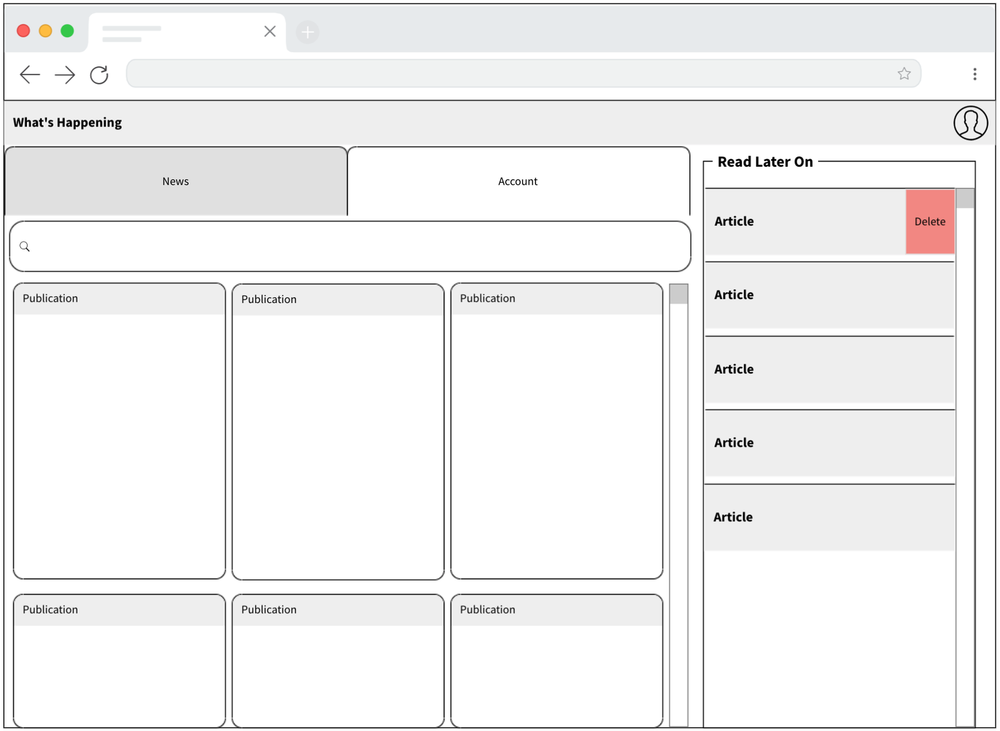

# News App

## Project Planning Breakdown

- Idea
- MVP
- Database Modeling
- API Endpoint Planning
- Backend Build
- Backend Testing
- Wireframes
- Component Planning
- Frontend Build
- Frontend Testing

## 💡 Idea: Place for all my newspaper subscriptions

| User story                                       | My story                                   |
| ------------------------------------------------ | ------------------------------------------ |
| As a (who wants to accomplish something)         | … subscriber to multiple newspapers.       |
| I want to (what they want to accomplish)         | … be able to see all my news in one place. |
| So that (why they want to accomplish that thing) | … I can bring all the thoughts together.   |

## 🤖 Tech Stack

MERN Stack

## ⚡ MVP

- Responsive
- User login with authentication
- Display Today's frontpage of varying newspapers
- User directed to articles they click on
- User can save articles

Nice-to-haves:
Twitter feed of tweets from accounts user picked, add/delete follows.

## ✍️ Wireframes

## 🔙 Backend Build

## 🗣️ API Endpoint Planning

## ✅ Backend Testing

## 💾 Database Modeling

## 🖱️ Frontend Build

## 🍱 Component Planning

## ✅ Frontend Testing
